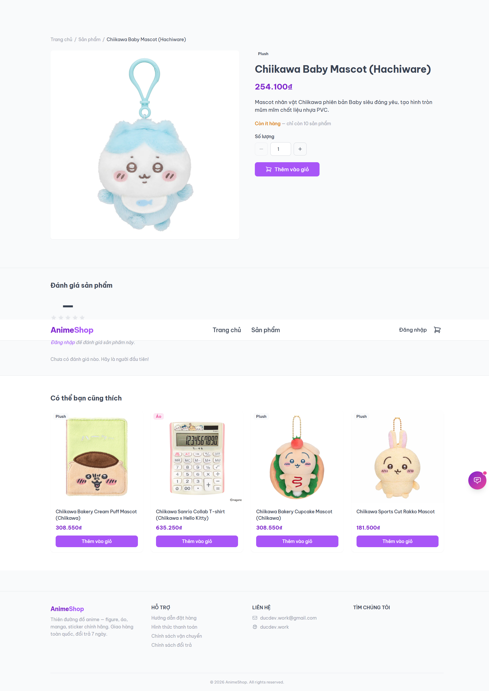
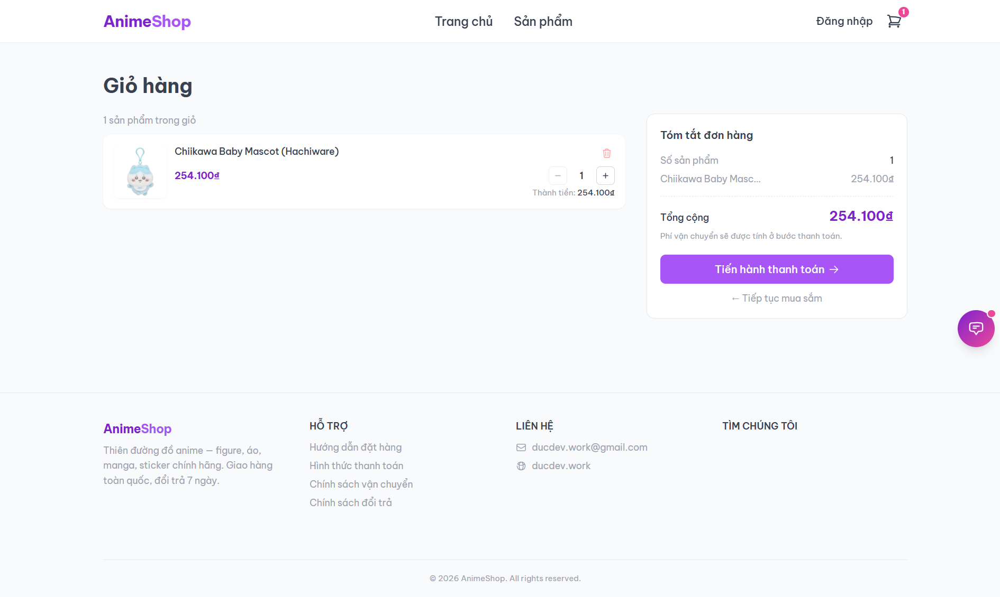
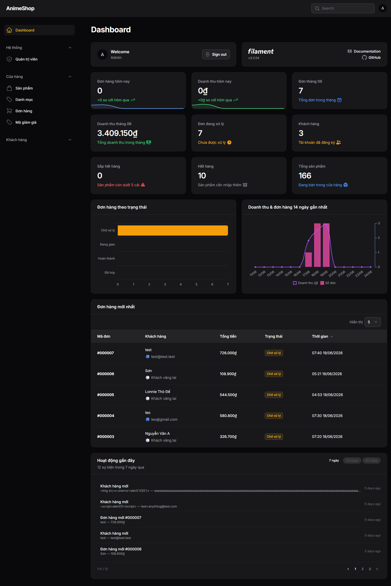

# Anime Shop

A full-featured e-commerce web application for anime merchandise (figures, apparel, manga, stickers), built with Laravel 12, Livewire 3, and Filament 3.

**Live demo:** [shop.ducdev.work](https://shop.ducdev.work)

---

## Screenshots

| Storefront | Product Detail |
|---|---|
|  |  |

| Checkout | Admin Dashboard |
|---|---|
|  |  |

> Screenshots are in [`docs/screenshots/`](docs/screenshots/). Run the app locally or visit the [live demo](https://shop.ducdev.work) to see it in action.

---

## Tech Stack


| Layer | Technology |
|---|---|
| Backend | Laravel 12, PHP 8.2 |
| Reactive UI | Livewire 3.5 + Alpine.js 3 |
| Admin panel | Filament 3 |
| Styling | Tailwind CSS 3 (mobile-first) |
| Database | MySQL 8.0 |
| Storage | Local disk / S3-compatible (AWS S3, Spaces, R2) |
| Infrastructure | Docker + Nginx + PHP-FPM |

---

## Features

### Customer-facing
- **Product catalog** — browse by category, search, sort (newest / price / popular)
- **Product detail** — image, description, stock status, related products
- **Shopping cart** — session-based, no login required; real-time icon update via Livewire events
- **Checkout** — guest or authenticated, address book, voucher/discount codes, note field; protected with honeypot + reCAPTCHA + rate limiting
- **Multiple payment methods** — Cash on Delivery (COD) and bank transfer
- **Order tracking** — order confirmation page with status badge; guest access via session token
- **Verified reviews** — only customers with a completed order can leave a review
- **Wishlist** — save favourite products (requires login)
- **User account** — order history, saved addresses, profile & password management
- **Static pages** — order guide, payment info, shipping policy, returns policy
- **XML sitemap** — auto-generated for products and categories

### Admin panel (`/admin`)
- **Dashboard** — 9 stat cards (today's orders & revenue, monthly, pending, low stock, out of stock), revenue line chart, order status chart, latest orders table, recent activity feed
- **Products** — full CRUD with image upload (local or S3), bulk import via XLSX
- **Categories** — CRUD with deletion guard (cannot delete if products exist)
- **Orders** — status management (`unpaid → pending → shipped → completed / cancelled`), read-only order items
- **Vouchers** — CRUD for discount codes (percent or fixed), expiry, min order, usage limit
- **Users** — read-only customer view with order stats
- **Admin accounts** — manage admin users independently from customers

---

## Architecture

This project follows a layered architecture to keep controllers thin and business logic testable:

```
HTTP Request
    └── Controller / Livewire component  (routing & UI state only)
            └── Action / Service         (business logic)
                    └── Model / Observer  (data & side-effects)
```

Key patterns used:

| Pattern | Example | When |
|---|---|---|
| **Action** | `PlaceOrderAction`, `ImportProductsAction` | One specific business operation |
| **Service** | `CartService` | Shared logic across multiple entry points |
| **Observer** | `OrderItemObserver` | Automatic side-effects on model events |
| **Eloquent scope** | `Product::scopeInStock()` | Reusable query constraints |

**Not used:** Repository pattern — Eloquent + scopes are sufficient.

### Order placement flow

```
Livewire Checkout
    ├── validate form + honeypot + reCAPTCHA + rate limit
    └── PlaceOrderAction::execute()  [DB transaction]
            ├── lock products for update
            ├── verify stock & price from DB (not session)
            ├── Order::create()
            ├── OrderItem::create() × N
            │       └── OrderItemObserver → Product stock decrement
            ├── Voucher::increment('used_count')
            ├── CartService::clearCart()
            └── session(['last_order_id' => $order->id])
```

---

## Technical Highlights

Key engineering decisions worth noting:

- **Reactive UI without a full SPA** — Livewire 3 enables real-time cart updates, live search/filter, and form interactions while keeping all logic server-side. No separate API or JS framework required.

- **Dual authentication guards** — `web` guard for customers (Breeze) and `admin` guard for Filament run fully independently. An admin session does not affect customer session and vice versa.

- **Guest-friendly order history** — Orders store `customer_email` instead of `user_id`. Customers who register after placing a guest order automatically see their order history.

- **DB-verified checkout** — `PlaceOrderAction` re-fetches prices and stock with `lockForUpdate()` inside a transaction, preventing race conditions and price manipulation from tampered sessions.

- **Environment-driven storage** — Switching from local to S3 requires only changing `APP_ENV`. No code changes needed; `ProductResource` and `Product::getImageUrlAttribute()` both read from the same environment check.

- **Soft deletes on products** — Products are never hard-deleted so historical order data remains intact. Admin "delete" moves the product to trash; past order items still resolve correctly via `withTrashed()`.

- **Code quality tooling** — PSR-12 enforced by Laravel Pint, static analysis by PHPStan, `declare(strict_types=1)` on every PHP file.

---

## Security

| Measure | Where |
|---|---|
| Honeypot field | Checkout form — catches bots silently |
| Google reCAPTCHA | Checkout form — human verification |
| Rate limiting | Checkout — max 5 submissions / minute per IP |
| CSRF protection | All forms via Laravel middleware |
| Session encryption | `SESSION_ENCRYPT=true` on production |
| Secure cookies | `SESSION_SECURE_COOKIE=true` on production |
| Dual auth guards | Admin panel isolated from customer sessions |
| Ownership check | Order detail: auth email match **or** `session('last_order_id')` |
| Verified reviews | Review submission requires a `completed` order containing the product |
| Soft deletes | Products never hard-deleted; historical order records preserved |
| Env-only secrets | No API keys or credentials in source code; `.env` is gitignored |
| No mass assignment | All models use explicit `$fillable` |

---

## Database Schema

10 tables, relationships at a glance:

```
users ──────────────────────────────────────────┐
  │                                             │
  ├── addresses (user_id FK)                    │
  ├── favorites (user_id FK, product_id FK)     │
  └── orders (via customer_email, not FK) ──────┼──┐
                                                │  │
categories ──── products (category_id FK) ──────┘  │
  │               │ (soft deletes)                  │
  │               └── order_items (product_id FK) ──┘
  │               └── reviews (product_id FK,        │
  │                            user_id FK,            │
  │                            order_id FK)           │
  │                                                   │
vouchers ── (applied at checkout, code stored on order)
```

| Table | Key columns |
|---|---|
| `users` | role (admin/customer), email |
| `products` | price decimal(10,2), stock, category_id, deleted_at |
| `orders` | customer_email, status, payment_method, voucher_code, discount_amount |
| `order_items` | order_id, product_id, quantity, price decimal(10,2) |
| `reviews` | product_id, user_id, order_id, rating, comment |
| `addresses` | user_id, label, recipient_name, is_default |
| `vouchers` | code, type (percent/fixed), value, min_order, max_uses, used_count |

---

## Getting Started

### Prerequisites
- Docker + Docker Compose

### Setup

```bash
# 1. Clone the repo
git clone <repo-url> anime-shop
cd anime-shop

# 2. Copy environment file and fill in values
cp .env.example .env

# 3. Start containers
docker compose up -d

# 4. Install dependencies
docker compose exec app composer install
docker compose exec app npm install

# 5. Generate app key
docker compose exec app php artisan key:generate

# 6. Run migrations and seed sample data
docker compose exec app php artisan migrate --seed

# 7. Link storage
docker compose exec app php artisan storage:link

# 8. Build assets
docker compose exec app npm run dev
```

App: **http://localhost:8005** · phpMyAdmin: **http://localhost:8080**

### Create an admin account

```bash
docker compose exec app php artisan make:filament-user
```

Admin panel: **http://localhost:8005/admin**

---

## Key Commands

```bash
# Migrations
docker compose exec app php artisan migrate
docker compose exec app php artisan migrate:fresh --seed

# Code quality
docker compose exec app ./vendor/bin/pint            # PSR-12 formatting
docker compose exec app ./vendor/bin/phpstan analyse  # static analysis

# Testing
docker compose exec app php artisan test

# Production build
docker compose exec app npm run build
```

---

## Environment Variables

Key variables beyond Laravel defaults:

| Variable | Purpose |
|---|---|
| `APP_ENV` | Controls storage disk: `local` → public disk, `production` → S3 |
| `RECAPTCHA_SITE_KEY` / `RECAPTCHA_SECRET_KEY` | Checkout spam protection |
| `AWS_*` | S3-compatible storage (S3, DigitalOcean Spaces, Cloudflare R2) |
| `SESSION_ENCRYPT` | Set `true` on production |
| `SESSION_SECURE_COOKIE` | Set `true` on production |

See `.env.example` for the full list.

---

## Project Structure

```
app/
├── Actions/          # Single-responsibility business operations
├── Services/         # Shared business logic (CartService)
├── Observers/        # Model event side-effects
├── Livewire/         # Reactive UI components (9 components)
├── Filament/
│   ├── Resources/    # Admin CRUD (6 resources)
│   └── Widgets/      # Dashboard widgets (5 widgets)
└── Models/           # Eloquent models with scopes & accessors

resources/views/
├── components/       # Reusable Blade components (x-button, x-product-card…)
├── livewire/         # Livewire component templates
└── {feature}/        # Page views (products, cart, checkout, orders, account…)
```

---

## Production Deploy

The project ships with a multi-stage `Dockerfile.prod`:
1. **Node stage** — builds frontend assets (`npm ci && npm run build`)
2. **PHP-FPM stage** — production-optimized image (`--no-dev`, opcache, healthcheck)

`docker/entrypoint.prod.sh` runs on container start:
```
wait for DB → migrate --force → storage:link → config/route/view cache → filament:cache-components → exec php-fpm
```

---

## License

MIT
